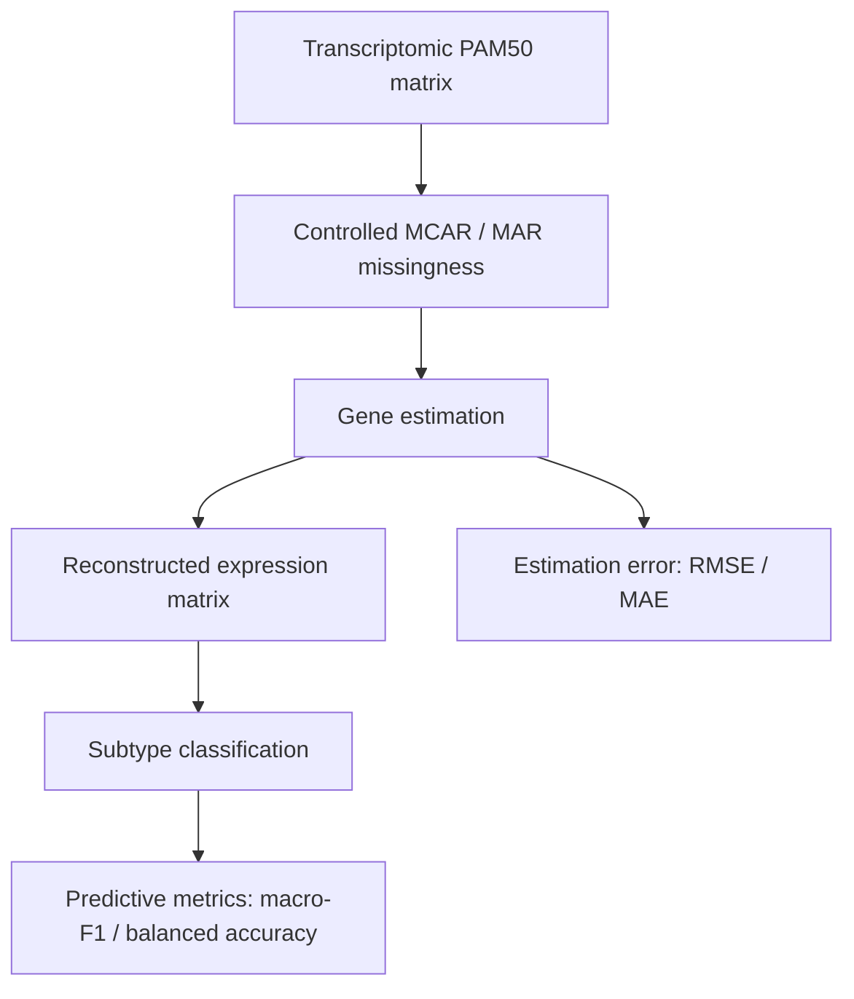

# Breast Cancer Transcriptomic Missing-Data Benchmark

Benchmarking missing-gene estimation strategies under controlled missingness
and evaluating their downstream impact on breast-cancer subtype
classification.

Python · scikit-learn · transcriptomics · missing data · feature selection ·
classification · reproducible evaluation

**Research benchmark — not a clinical diagnostic system.**

## Overview

Breast-cancer PAM50 gene-expression matrices are complete in the prepared
cohorts used here. The study **simulates** missing values (MCAR and MAR) at
known rates, estimates the held-out cells, and then classifies samples into
four PAM50 subtypes (LumA, LumB, Her2, Basal).

Two questions are kept separate:

1. **Estimation quality** — how close are filled-in expression values to the
   held-out truth (RMSE / MAE)?
2. **Downstream classification** — how do reconstructed matrices affect
   subtype prediction (macro-F1 / balanced accuracy)?

The principal estimation method is **OriginalRFECA TARGET-WISE**: per target
gene, predictors are selected dynamically (Pearson ranking → prefix search →
RFE + linear SVR) from the original complete matrix. Imputed values are
**not** reused as predictors. Evaluation of estimation error is
`repeated_mask_holdout` on persisted masks.

## Research questions

- Under controlled MCAR/MAR missingness on METABRIC PAM50, how do Mean, KNN,
  MissForest-like imputation, and OriginalRFECA TARGET-WISE compare on
  holdout RMSE/MAE?
- Does OriginalRFECA keep estimation error stable as the missingness rate
  increases?
- After reconstruction, how does EnsembleSoft PAM50 classification behave
  across methods and rates — noting that classification nesting is not
  identical for every method?

## Pipeline



## Methods

Canonical freeze: **`v0.3.1-original-rfeca-targetwise`**
(`artifacts/original_rfeca_reduced_metabric/FREEZE/` and `docs/methodology.md`).

| Piece | As executed |
|---|---|
| Cohort | METABRIC PAM50, n=1608, 50 genes, 4 subtypes |
| Missingness | MCAR and MAR; exact cell counts; rates 5, 10, 20, 30%; 5 replicates |
| Principal estimator | OriginalRFECA TARGET-WISE, leakage-safe Pearson prefixes + RFE + SVR |
| Predictors per gene | Dynamic (prefix search; RFE ≈ half the prefix). Pool cap = 49 |
| Chaining / SimpleImputer on predictors | Not used on the principal path |
| Fair baselines | Mean, KNN (k=5), MissForest-like, **same freeze masks**, holdout RMSE |
| Classification | EnsembleSoft (SVC + LogReg + RF + GB); StratifiedKFold(5), seed 42 |
| OriginalRFECA classification nesting | Post-imputation (identity imputer inside CV) |

Legacy `RFECA_SVR(k=5|10|20)` exists in older campaigns and is **not** the
retained principal method.

## Evaluation

**A. Estimation** (primary for method comparison): RMSE and MAE on
artificially masked cells. Preferred paired table:
`artifacts/final_analysis/fair_imputation_comparison_display.csv`.

**B. Classification** (secondary): macro-F1 and balanced accuracy. OriginalRFECA
F1 is post-imputation CV; baseline F1 in some tables used imputer-in-CV.
Those F1 columns are **descriptive**, not a paired confirmatory test
(`artifacts/final_analysis/central/caveats.md`).

## Results (aggregate, already produced)

Holdout RMSE (mean ± sd over replicates), fair protocol, METABRIC.
Source: `artifacts/final_analysis/fair_imputation_comparison_display.csv`.

| Mechanism | Rate | Mean | KNN | MissForest | OriginalRFECA |
|---|---|---|---|---|---|
| MCAR | 5% | 1.057 ± 0.013 | 0.672 ± 0.007 | **0.607 ± 0.012** | 0.613 ± 0.012 |
| MCAR | 10% | 1.073 ± 0.007 | 0.684 ± 0.009 | 0.620 ± 0.012 | **0.615 ± 0.008** |
| MCAR | 20% | 1.068 ± 0.006 | 0.706 ± 0.003 | 0.626 ± 0.005 | **0.614 ± 0.005** |
| MCAR | 30% | 1.067 ± 0.006 | 0.731 ± 0.002 | 0.647 ± 0.005 | **0.621 ± 0.004** |
| MAR | 5% | 1.169 ± 0.018 | 0.698 ± 0.015 | **0.632 ± 0.008** | 0.641 ± 0.015 |
| MAR | 10% | 1.176 ± 0.008 | 0.707 ± 0.011 | 0.643 ± 0.014 | **0.639 ± 0.011** |
| MAR | 20% | 1.147 ± 0.010 | 0.740 ± 0.011 | 0.665 ± 0.004 | **0.640 ± 0.005** |
| MAR | 30% | 1.145 ± 0.004 | 0.844 ± 0.011 | 0.699 ± 0.006 | **0.639 ± 0.002** |

OriginalRFECA has the lowest mean RMSE in 6 of 8 mechanism×rate cells; MissForest
is lowest at MCAR 5% and MAR 5%. OriginalRFECA RMSE is nearly flat across rates.
All 40 freeze slots: operational class A, SVR coverage 1.0, fallback rate 0.

Figures: `artifacts/final_analysis/figures/`.

## Repository structure

```
.
├── src/bcimpute/                 # Package: missingness, estimators, evaluation
│   └── imputation_original/      # OriginalRFECA TARGET-WISE implementation
├── experiments/                  # Full-benchmark / freeze runners (opt-in)
├── scripts/                      # Data prep, smoke tests, paper tables
├── configs are in code           # ExperimentConfig in src/bcimpute/config.py
├── data/                         # See data/README.md (raw downloads ignored)
├── artifacts/                    # Executed results (aggregates + freeze)
├── docs/                         # Methodology + reproducibility
├── notebooks/                    # Legacy Colab notebook
└── archive/                      # Historical conference-era aggregate metrics
```

## Reproducibility

```powershell
python -m pip install -r requirements.txt
python experiments\run_original_rfeca_targetwise.py --help
python experiments\run_fair_baseline_holdout_vs_rfeca.py --help
python scripts\test_mask_holdout_leakage.py
```

After you have prepared the METABRIC PAM50 matrix locally (`data/README.md`):

```powershell
python scripts\test_prepare_metabric.py
```

The 40-slot freeze takes many hours. Commands, seeds, and known doc mismatches:
`docs/reproducibility.md`. Pin file: `requirements-freeze-v0.3.txt`.

## Data

Principal analysis uses a 50-gene METABRIC PAM50 matrix prepared from
cBioPortal `brca_metabric` (ODbL). **That matrix is not in this repository.**
Download the study, run `scripts/prepare_metabric.py`, then validate with
`scripts/test_prepare_metabric.py`. Full microarray files, CPTAC clinical
tables, and recovered participant IDs are also excluded.
Instructions: `data/README.md`.

## Research output

**Benchmark of Estimation Strategies for Breast Cancer Transcriptomic Data
under Controlled Missingness**

Status: **Submitted / awaiting peer review.**

This repository publishes code, methodology, and safe aggregate results — not
the submitted manuscript PDF.

## Limitations

- PAM50 (50 genes) is a small, correlated panel; results do not automatically
  extend to genome-wide RNA-seq.
- MissForest in code is IterativeImputer + ExtraTrees (MissForest-*like*).
- Fair RMSE uses the same masks; some classification tables mix post-imputation
  CV with imputer-in-CV nesting.
- Discovery (n=117) is an auxiliary historical campaign, not the freeze.
- Computational cost of per-gene RFE+SVR limited how nested the principal
  estimator’s outer evaluation could be (`repeated_mask_holdout` vs nested CV).

## Disclaimer

This project is a methodological benchmark on public research cohorts. It is
**not** a medical device, not a diagnostic test, and not intended for clinical
decision-making.
