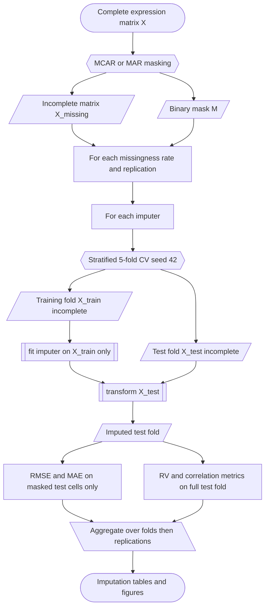
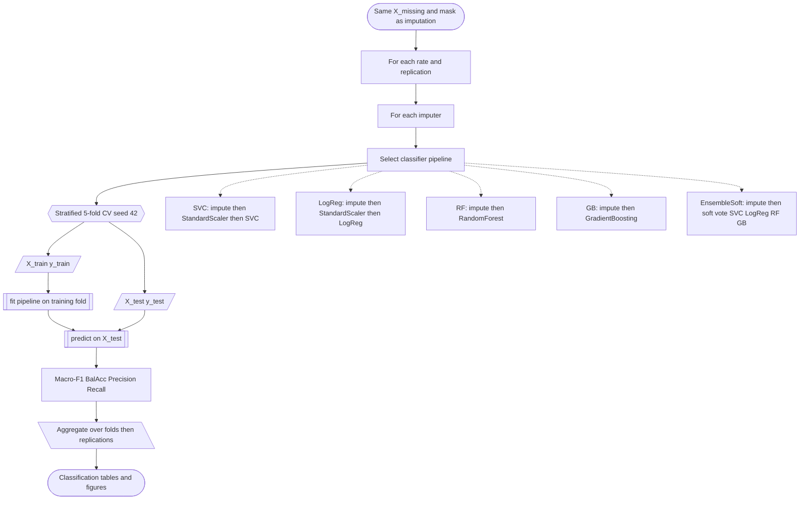

# Experimental pipeline diagrams

Publication-oriented flowcharts matching `src/bcimpute/evaluation.py` and `pipelines.py`.  
Paste each Mermaid block into any Mermaid renderer (GitHub, Quarto, [mermaid.live](https://mermaid.live)).

Shared protocol (both experiments):

- Artificial missingness: MCAR or MAR; rates 0–30%; 10 replications
- Same mask shared across imputers within each rate times replication
- Stratified 5-fold CV; `random_state=42`
- No train/test leakage: fit on training fold only

---

## Figure A — Imputation evaluation pipeline

**Notes**

- Ground-truth for RMSE/MAE: original complete values at cells where `M = true` on the test fold.
- RV compares gene–gene Pearson correlation of the complete test fold versus the imputed test fold (all cells, not masked-only).
- Training fold is used to fit the imputer; reconstruction metrics are reported on the held-out fold.

---

## Figure B — Downstream classification pipeline

**Notes**

- Paper primary endpoint uses **EnsembleSoft**; individual classifiers are for the interaction analysis.
- Imputation inside the sklearn `Pipeline` is **independent** of the imputation-experiment fit (clone per fold; same mask and CV splits).
- Scalers, when present, are fit on the training fold only.
- Main Tables 1 / S1 / S2 report EnsembleSoft Macro-F1; multi-clf interaction uses the dedicated METABRIC multi-classifier run.

---

## How the two pipelines relate

Both use identical missingness masks and stratified CV splits, but each experiment **re-fits** imputation independently so there is no cross-experiment model reuse.
