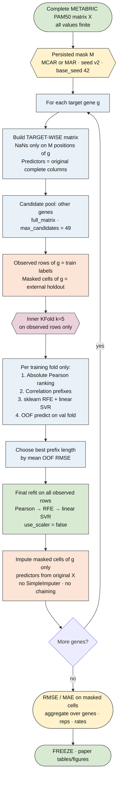

# OriginalRFECA TARGET-WISE — flowchart

Protocol frozen as `v0.3.0-original-rfeca-targetwise`.

Render the Mermaid block at [mermaid.live](https://mermaid.live) or in GitHub/Quarto.  
Figures: `flowchart_original_rfeca.png` / `.pdf`.

## Guarantees encoded in the flow
- Masked target values never enter correlation, RFE, or final SVR fit
- Predictors are never mean-filled or chained from other imputed genes
- RFE during selection runs only on each inner-train fold; final RFE/SVR uses all observed (non-masked) rows
